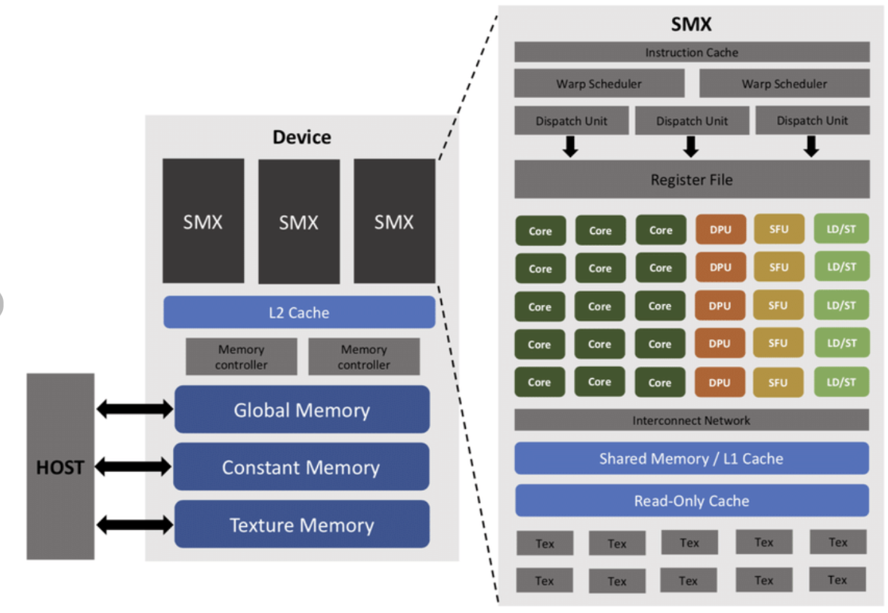

+++
date = '2026-04-30'
draft = false
title = 'NVIDIA GeForce GPU Architecture'
+++

## Intro
This blog post highlights the important components in a GeForce GPU and how it interfaces with the CPU. 

The "Host" CPU interfaces with the "Device" GPU through PCIe busses. The CPU writes information to the GPU's global memory VRAM. The GPU unit has read only constant/texture memory regions. Constant memory is always available to threads while texture memory is for 2d spatial locality like image processing or computer vision tasks. Each GPU also contains 100+ SMX devices which do heavy lifting work. If the SMX does not have data it needs, it will access the L2 cache or pass the request to the multiple memory controllers on the device to get data from global memory.

  

   

#### Device
    * CPU: manages GPU via commands, kernel codes and data via PCIe bus
    * Global Memory: primary VRAM for GPU
    * Constant & Texture memory: read only
         * Constant: available to threads
         * Texture: 2D spatial locality (image processing, computer vision)
    * Streaming Multiprocessors (SMX): main workhorse
    * L2 cache: shared cache that's used by all SMXs
          * Don't nee to use global memory then
    * Memory controller
	 * Is used when SMX request to L2 cache fails
	 * Queries VRAM
	 * Ensures SMX cores and L2 cache have data

#### Device: Memory Controller
The goal of the memory controller is to ensure the SMXs always have data since they are constantly doing work. When the SMX requests data, it goes to the L2 cache, but when that fails the L2 cache will forward the request to the memory controller to get from global memory/VRAM.

    * Each memory controller maps to a part of the L2 cache and a corresponding portion of physical VRAM
    * The L2 cache will determine which memory controller to query based on the address request
    * The memory controller will then perform address translation between logical memory address and physical rows
    * Manages data between SMX and Global Memory/VRAM
    * SMX will do a lot of calculations and need more data
        * Ensures SMX cores and L2 cache have data

#### [Device: Streaming Multiprocessor (SMX)]()

