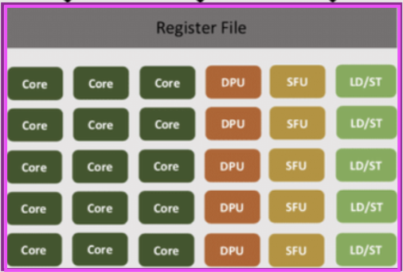
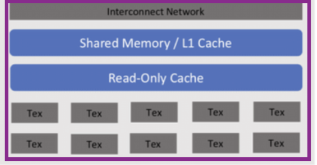

The SMX can be logistically broken down into three processing units: scheduling, execution, and networking/memory.

## SMX: Scheduling

The scheduling units load the instruction from the instruction cache, and the dispatch unit determines which execution component to send it to. The Warp Scheduler manages threads.

- **Instruction Cache** — stores the instruction currently being executed
- **Warp Scheduler** — manages threads and decides which ones should be executed
- **Dispatch Unit** — receives instructions from the scheduler and forwards them to the appropriate execution components of the SMX (Core, DPU)

## SMX: Execution

The execution units read data from the register file, perform processing, and write the result back to the register file data bus. The instruction being executed determines which hardware unit is used. The LD/ST units move data between memory (L1, L2, Global) and the register file.

- **Register File** — staging area for data; queries L1 cache or other memory if the needed data is absent
- **Core (CUDA Cores)** — handles standard integer and floating-point arithmetic
- **DPU (Double Precision Unit)** — specialized FP64 (double precision) unit, typically used for scientific simulations
- **SFU (Special Function Units)** — handles complex transcendental math (sin, cos, square root, log)
- **LD/ST (Load/Store Units)** — move data between the register file and memory (L1, L2, Global Memory)

## SMX: Networking and Memory

- **Interconnect Network** — connects execution units to local memory and cache
- **Shared Memory / L1 Cache** — high-speed, low-latency memory shared by all threads on the SMX
- **Read-only Cache** — read-only during kernel execution
- **Texture Units (Tex)** — handle texture mapping, filtering, and address operations
