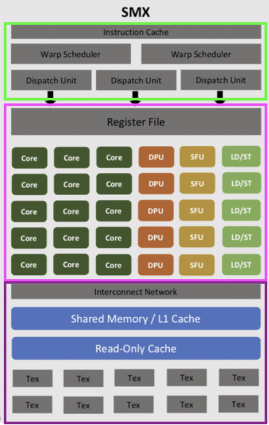
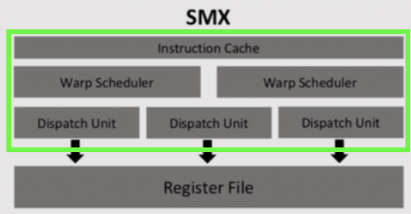

The SMX does work for threads, not processes.  
 

## Software Threads

The programmer defines the number of thread blocks for a process and the number of threads per block. Per block there can be a maximum of 1 or 1024 (32 x 32) threads.  The SMX queues up thread blocks to be executed. 

- **Thread Blocks** - defined by software engineer and has x number of threads per block

## Hardware Threads

The SMX hardware executes threads as a WARP. The SMX is the factory floor, whereas a WARP is a cleaning crew on the floor. The SMX can have up to 64 WARPS and each WARP has 32 threads. The SMX has up to four Warp Schedulers (which is part of the SMX scheduling unit) to determine which warp and thread blocks should be executed. 

The WARP scheduler determines which WARP (e.g., 32 threads) to execute. Once the WARP is chosen, the instruction is loaded into the dispatch unit and sent to 32 cores to be processed at the same time for the 32 threads.

The SMX execution units (Cuda, DPU, SFU, LD/ST cores) may not have 32 cores available, in which case the instruction would be executed over multiple clock cycles (e.g., 32 threads/4 units = 8 cycles).

## How do threads interface with the register file? AKA Logical Splitting of Register File
NVIDIA promises that threads get their own slice of the register file, so two threads do not share the same register. SMX hardware promises N registers per thread, so Thread 1's R5 doesn't impact Thread 2's R5. 

Once the instruction is done being executed, the core writes the data back to the register file. If 32 cores have computed "ADD r5, r4, r1, rz" to execute r5 = r4+r1, then all 32 cores need to access and write to the r5 register. How to we prevent all 32 threads from accessing the same r5 register address? The WARP Base Pointer plus some thread context. The WARP Base Pointer lets you know where where the base of the register file for a thread starts. 

**Physical Address = WARP Base Pointer + (Register Index * WARP Size) + Thread**

Assuming there are 32 threads in the WARP:

- **Thread 1** R5 physical address = WARP Base + (5 * 32) + 1
- **Thread 2** R5 physical address = WARP Base + (5 * 32) + 2

